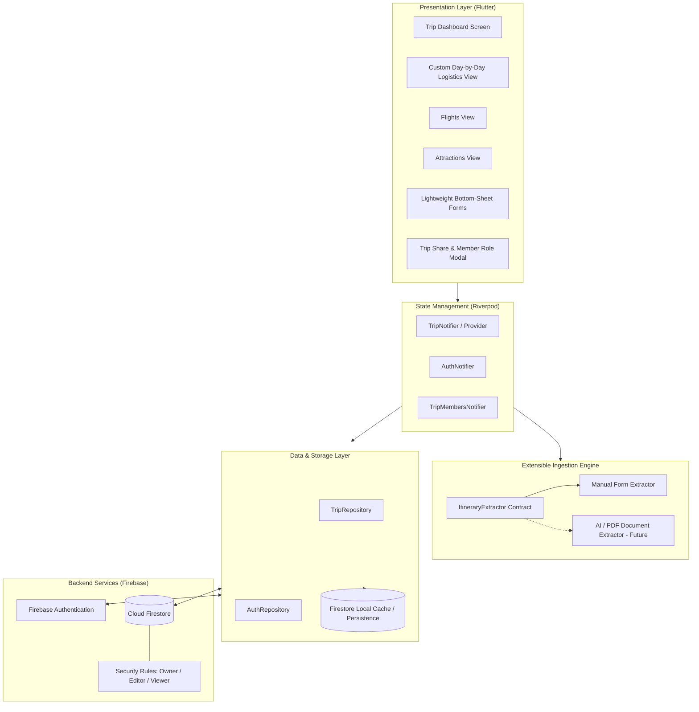

# Technical Specification & Implementation Plan: Trippy Mobile App

Trippy is a cross-platform mobile application built with **Flutter** (optimized natively for Android) designed to organize, visualize, and collaborate on travel itineraries.

### Confirmed Architectural Decisions
- **Framework**: **Flutter (Dart)** for cross-platform support with native Android compilation, high-performance custom canvas rendering (`CustomPainter` / `CustomMultiChildLayout`), and official FlutterFire support.
- **Logistics Visualization**:
  - Consecutive days rendered as side-by-side vertical rectangles with smooth horizontal scrolling.
  - **Option A (Header Bridge)**: Horizontal rectangles spanning across the tops of consecutive day columns to represent multi-day stays (hotel/lodging) or overnight transitions (red-eye flights).
  - **Dynamic Card Sizing**: Event segments inside each day rectangle are sized dynamically by content in chronological order (with clear departure/arrival/activity timestamps), avoiding dead space.
- **Multi-User Collaboration**:
  - **Firebase** (Cloud Firestore with offline persistence + Firebase Auth).
  - **Single Invite Code**: 6-character code (e.g., `TRIP-7K9X`) generated per trip, with the owner configuring the invited role (**Editor** vs. **Viewer**).
- **Data Ingestion**:
  - Lightweight, responsive data entry bottom-sheets for manual input.
  - Extensible `ItineraryExtractor` pipeline ready for future multimodal AI / PDF / email parsing.

---

## User Review Required

> [!NOTE]
> All core architecture decisions (Flutter, Option A Header Bridge, dynamic card sizing, single configurable invite code, Firebase) are now confirmed and approved. We are ready to begin Phase 1 upon SDK environment verification.

---

## System Architecture



---

## Custom Logistics Visualization: Concrete Layout Specification

### 1. Visual Schematic (Option A: Header Bridge)

```
        ==================== [STAY BRIDGE] ====================
        |  Grand Hyatt Tokyo                                  |
        |  Check-in: Mon 15:00 | Conf: #GH-82910              |
        =======================================================
               |                                      |
   +-----------------------+              +-----------------------+
   | DAY 1: Mon, Oct 12    |              | DAY 2: Tue, Oct 13    |
   +-----------------------+              +-----------------------+
   | [09:30] ✈️ Flight Arr  |              | [08:30] 🍳 Tsukiji Mkt|
   | NH203 from SFO        |              | Breakfast food walk   |
   | Terminal I, Gate G10  |              |-----------------------|
   |-----------------------|              | [10:30] 🏛️ Senso-ji   |
   | [11:30] 🚆 N'EX Train |              | Temple Tour & Shrine  |
   | to Shinjuku           |              | Reserved Tickets #42  |
   |-----------------------|              |-----------------------|
   | [15:00] 🏨 Check-in   |              | [14:00] 🛍️ Akihabara   |
   | Hotel Luggage Drop    |              | Electronics & Arcade  |
   |-----------------------|              |-----------------------|
   | [18:30] 🍽️ Shibuya     |              | [19:00] 🍸 Roppongi   |
   | Crossing Dinner       |              | Observation Deck      |
   +-----------------------+              +-----------------------+
        =================== [OVERNIGHT FLIGHT] ===================
        |  ✈️ JL006 Tokyo (HND) -> San Francisco (SFO)           |
        |  Departs: Tue 21:30 | Arrives: Wed 15:00 (Next Day)   |
        =========================================================
```

### 2. Layout Geometry & Custom Rendering
- **Day Column Width**: Fixed `300dp` with `20dp` gutter between consecutive day columns.
- **Scroll Behavior**: Single horizontal scroll view allowing frictionless panning across the entire trip timeline.
- **Stay Bridge Placement**:
  - Rendered in a dedicated layout track directly spanning the horizontal gap between Day $N$ and Day $N+1$.
  - Connected via subtle vertical anchor tick lines down to the corresponding day headers.
  - Width: Exactly $2 \times \text{dayWidth} + \text{gutter} = 620\text{dp}$ minus edge padding.
- **Overnight Flight Exception**:
  - When an itinerary item spans past midnight into the arrival date, it is rendered in the cross-day transition slot with distinctive flight styling (flight icon, origin $\rightarrow$ destination badge, and departure/arrival local times).
- **Dynamic Chronological Segment**:
  - Each activity card inside the day rectangle occupies only the height needed for its title, time, category icon, and booking reference.
  - Free-time indicators (e.g. dashed line connector with duration label) visually connect sequential events.

---

## Data Models (Dart & Firestore)

### 1. `Trip`
```dart
class Trip {
  final String id;
  final String title;
  final String destination;
  final DateTime startDate;
  final DateTime endDate;
  final String? coverImageUrl;
  final String ownerId;
  final String inviteCode; // 6-character code e.g. "TRIP-7K9X"
  final String defaultInviteRole; // "editor" | "viewer"
  final Map<String, String> members; // userId -> "owner" | "editor" | "viewer"
  final DateTime createdAt;
  final DateTime updatedAt;
}
```

### 2. `Stay` (Lodging & Overnight Spans)
```dart
enum StayType { hotel, rental, overnightFlight, nightTrain }

class Stay {
  final String id;
  final String tripId;
  final StayType type;
  final String name; // e.g. Hotel name or "Flight NH203"
  final String? address;
  final DateTime checkInDate;
  final String? checkInTime;
  final DateTime checkOutDate;
  final String? checkOutTime;
  final String? confirmationCode;
  final String? notes;
  final FlightDetails? overnightFlightDetails;
}
```

### 3. `Activity` (Events within Day Columns)
```dart
enum ActivityCategory { attraction, dining, transport, entertainment, flight, custom }
enum BookingStatus { planned, booked, ticketed }

class Activity {
  final String id;
  final String tripId;
  final DateTime date;
  final String startTime; // "HH:mm"
  final String? endTime;
  final String title;
  final ActivityCategory category;
  final String? location;
  final BookingStatus bookingStatus;
  final String? confirmationRef;
  final String? ticketUrl;
  final String? notes;
}
```

### 4. `Flight` (Specialized Flight Model)
```dart
class Flight {
  final String id;
  final String tripId;
  final String airline;
  final String flightNumber;
  final String departureAirport;
  final String arrivalAirport;
  final DateTime departureTime;
  final DateTime arrivalTime;
  final bool isOvernight;
  final String? terminal;
  final String? gate;
  final String? seat;
  final String? bookingRef;
}
```

---

## Multi-User Security & Collaboration Rules

### Invite Code & Membership Flow
1. **Trip Creation**:
   - Owner creates trip $\rightarrow$ System generates unique 6-character uppercase code (e.g. `TRIP-7K9X`).
   - Owner can toggle the code's assignment role: **Editor** (can edit itinerary) or **Viewer** (read-only).
2. **Joining a Trip**:
   - Co-traveler inputs the 6-character code in the "Join Trip" modal.
   - Firestore query validates the code and adds the co-traveler's `userId` into `members[userId] = defaultInviteRole`.
3. **Role Permissions**:
   - **Owner**: Full access + delete trip + regenerate invite code + change member roles.
   - **Editor**: Add/edit/delete activities, stays, and flights.
   - **Viewer**: Read-only access to all trip views; edit buttons and fab are hidden or disabled.

---

## Extensible Document Ingestion Engine

```dart
abstract class ItineraryExtractor {
  Future<ParsedItineraryDraft> extractFromText(String rawContent);
  Future<ParsedItineraryDraft> extractFromDocument({required List<int> bytes, required String mimeType});
}

class ParsedItineraryDraft {
  final List<Stay> stays;
  final List<Activity> activities;
  final List<Flight> flights;
}
```
- In the initial phase, `ManualFormExtractor` routes user input from bottom-sheet forms directly to validated entities.
- The `ParsedItineraryDraft` structure allows the future multimodal parser (PDF / Email forwarding / paste) to populate a draft review screen without altering the core trip repositories or UI logic.

---

## Implementation Phases

### Phase 1: Environment & Project Foundation
- Verify/install Flutter SDK and configure Android toolchain.
- Create Flutter project structure (`trippy`) with Material 3 styling and responsive layout foundation.
- Setup Riverpod state management and service locator.
- Implement domain models (`Trip`, `Stay`, `Activity`, `Flight`) with robust JSON serialization and unit tests.

### Phase 2: Firebase Backend & Multi-User Collaboration
- Configure Firebase Authentication (Google Sign-In + Anonymous auth for frictionless onboarding).
- Configure Cloud Firestore with local offline persistence enabled.
- Implement `TripRepository` with real-time stream listeners.
- Implement single-code invite lookup and role assignment logic (`editor` vs `viewer`).

### Phase 3: Custom Day-by-Day Logistics Visualization
- Build `LogisticsTimelineView` with horizontal scrolling across consecutive days.
- Implement `DayColumnWidget` with dynamic vertical card sequences and category color accents.
- Implement `StayHeaderBridgeWidget` spanning Day $N$ and Day $N+1$, supporting both hotel stays and overnight flight exceptions.
- Add tap-to-inspect and tap-to-edit interactions (with Viewer role permission guards).

### Phase 4: Flights View & Attractions View
- **Flights View**: Chronological breakdown of air travel with layover indicators, airport badges, and gate/terminal/seat cards.
- **Attractions View**: Categorized activity grid with status filters (`Booked`, `Planned`), checklist progress, and search.

### Phase 5: Lightweight CRUD Forms & Extensible Ingestion Skeleton
- Build fast bottom-sheet forms for adding/editing Stays, Activities, and Flights.
- Build Trip Settings & Share modal (displaying invite code, QR, and role toggle).
- Create `ItineraryExtractor` interface and draft review screen skeleton for future document imports.

### Phase 6: Automated Testing & Verification
- Unit tests for data models, time parsing, and stay span calculations.
- Widget tests for the custom day-by-day logistics layout.
- Multi-user permission tests (validating Viewer vs. Editor restrictions).

---

## Verification Plan

### Automated Tests
- `flutter test test/models/trip_model_test.dart`: Validates serialization and date handling.
- `flutter test test/views/logistics_bridge_test.dart`: Validates calculation of stay span coordinates across consecutive days.
- `flutter test test/services/invite_code_test.dart`: Validates invite code validation and role assignment.

### Manual Verification
1. **Custom Logistics Visualization**:
   - Create a 4-day trip:
     - Night 1: Hotel stay spanning Day 1 & Day 2.
     - Night 2: Overnight flight spanning Day 2 & Day 3.
     - Night 3: Rental stay spanning Day 3 & Day 4.
   - Verify all horizontal bridges align seamlessly across the corresponding day columns.
2. **Multi-User Collaboration**:
   - Log in User A (Owner), set invite code role to `viewer`.
   - Log in User B on a second session, enter invite code.
   - Verify User B can see the complete itinerary in real-time, but has all edit/delete actions disabled.
3. **Offline Sync**:
   - Disconnect network, create an activity, reconnect, and verify persistence.
